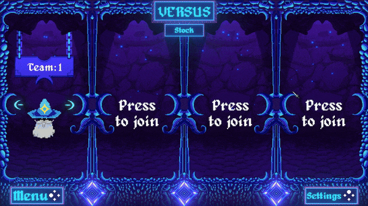

# Filip Salomonsson Portfolio
  
CV link:   

# Game Projects

## [***VR Party***](VR_Party) ← Click here for more info!
Developed: *2025 March - Current*  
Engine: Unity  
Genré: VR, Local Multiplayer, Party Game, Mini Games, Competitive
Team: 4 programmers and 6 Artist  
Role: Lead Programmer

<table>
  <tr>
    <td></td>
    <td></td>
  </tr>
</table>

---

## [***VR Snap***](VR_Snap) ← Click here for more info!
Developed: *2025 February - 2025 March*  
Engine: Unity  
Genré: VR, Simulation
Team: Solo 

<table>
  <tr>
    <td></td>
    <td></td>
  </tr>
</table>

---

## [***Tamagotchi Simulator***](Tamagotchi_Sim) ← Click here for more info!
Developed: *2025 January - 2025 February*  
Engine: Unity  
Genré: Mixed Reality (MR), Singelplayer, Pet, Simulation  
Team: 1 programmers and 1 Artist  
Role: Programmer

<table>
  <tr>
    <td></td>
    <td></td>
  </tr>
</table>

---

## [***ScrapBattle***](ScrapBattle) ← Click here for more info!
Developed: *2024 December - 2025 January*  
Engine: Unity  
Genré: Vr, Singelplayer, Builder, Simulation  
Team: 2 programmers and 3 Artists  
Role: Lead Programmer, LevelDesigner  

<table>
  <tr>
    <td></td>
    <td></td>
  </tr>
</table>

---

## [***LightBound Together***](LightBound_Together) ← Click here for more info!
Developed: *2024 September - 2024 November*  
Engine: Unity  
Genré: Co-op, Physics Multiplayer, Puzzle Adventure, Parkour 3D Platformer, Horror  
Team: Solo 

<table>
  <tr>
    <td></td>
    <td></td>
  </tr>
</table>

---

## [***Deep Pressure***](DeepPressure) ← Click here for more info!
Developed: *2024 Augusti - 2024 September*  
Engine: Unity  
Genré: VR, Single player, Submarine Simulator, Horror  
Team: 4 Programmers  
Role: Programmer, Enviroment and Submarine Designer

<table>
  <tr>
    <td></td>
    <td></td>
  </tr>
</table>

---

## [***Starlitseas***](Starlitseas) ← Click here for more info!
Developed: *2024 April - 2024 Juni*  
Engine: Unreal Engine  
Genré: First Person, Single player, Parkour Speedrunner  
Team: 4 Programmers and 3 Artists   
Role: Lead Programmer

<table>
  <tr>
    <td></td>
    <td></td>
  </tr>
</table>

---

## [***Spellslingers***](SpellSlingers) ← Click here for more info!
Developed: *2024 November - 2024 Januari*  
Engine: Unity  
Genré: Pixel art, Top-down, Local multiplayer arena shooter, Controller game  
Team: 3 Programmers and 3 Artists  
Role: UI Programmer

<table>
  <tr>
    <td></td>
    <td></td>
  </tr>
</table>

---

## [***Frostfall***](Frostfall) ← Click here for more info!  
Developed: *2024 May - 2024 May*  (2 week project)    
Engine: Unreal Engine  
Genré: Low resolution PS1 graphics, First person, Solo, Horror game  
Team: Solo   

<table>
  <tr>
    <td></td>
    <td></td>   
  </tr>
</table>

---

Old Game Projects
 

## Islands of Tjom  
In 2021 i spent half a year learning how to make a cool looking cartoon style 3D rpg/survival game in unity for my degree project.   
In the link below is my essay and a powerpoint on the game (in Swedish).

Degree project essay and powerpoint: [Drive_Document](https://drive.google.com/drive/folders/1aACRJVYvIYw3PrxSMH7jPCPunhG_WQpW)

## Tjom
Tjom is a retro mario type game, made in Unity. A solo, 2 week project. Tjom has 3 levels, 2 normal and 1 boss level. Made in 2020.

Website link: [Tjom indiedb](https://www.indiedb.com/games/tjom/downloads/tjom)

